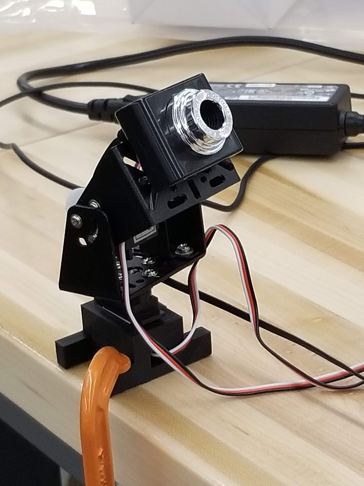

# Visual Servo Hackathon
### Josh Cohen MSR Sept 16-18

The goal of this hackathon was to have a camera mounted on a two servo 'gimbal' that will track a ping pong ball held in space such that it centers the ball on its screen. The python open cv library was used along with the maestro servo controll board from Pololu.

## Visual Servo 
The visual servo file defines the servo controller class which instantiates to child servo classes. The servo class has the ability to communicate with th e Polulo board and get position of the servos as well as set position, velocity, and acceleration of the servos.

## Video Capture  
The video capture file is the main file of the project containing the main loop. This file captues an image from the camera mounted on the servo gimble, processes the image from rgb to hsv color encoding, masks the image to find the ping pong ball, performs bitwise operations on the result, and finds the contours of that image to get a representation of the bounding circle. It calculates the centroid of the circle and then commands the servo motors to move the gimble such that the camera is centered on the centroid. It does this using proportional control of a cubic error term.